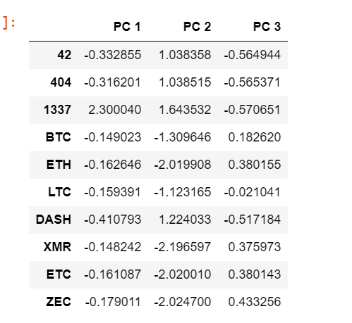
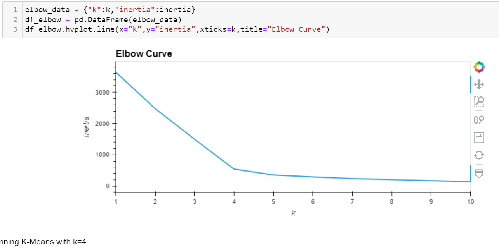
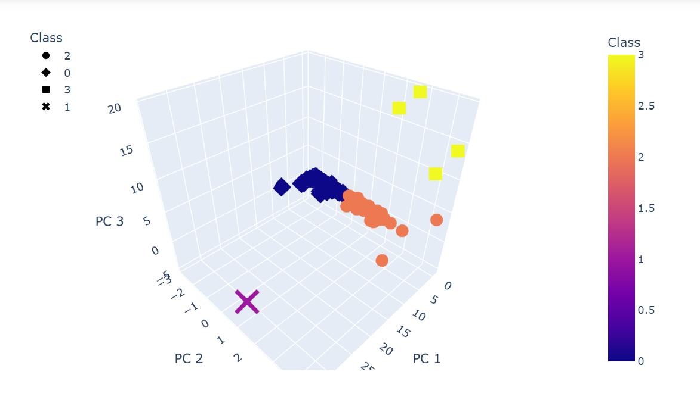
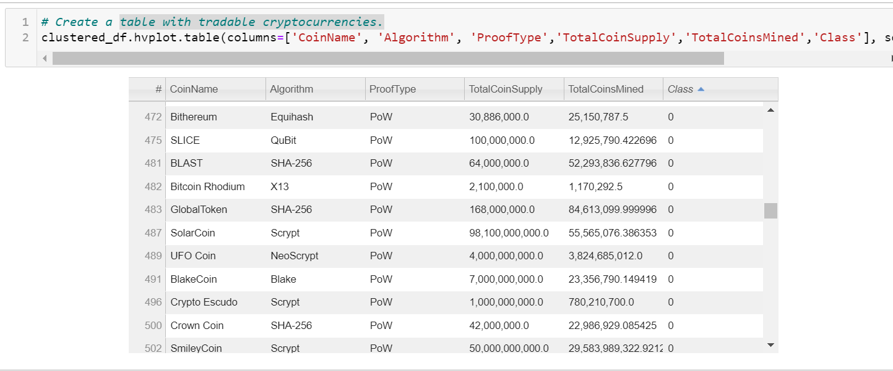
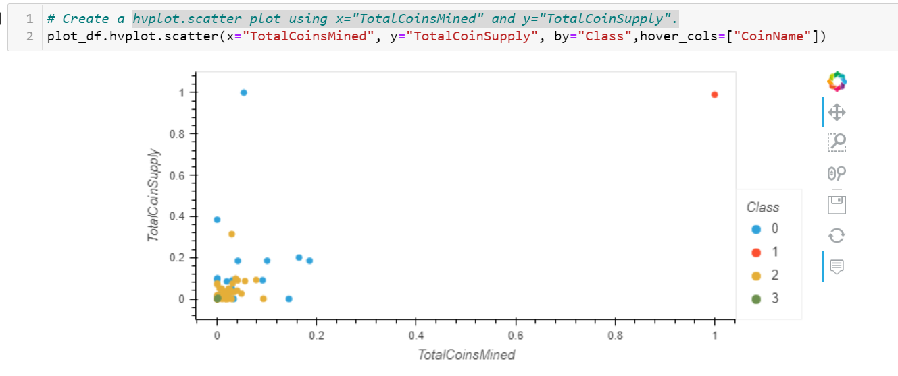

# Cryptocurrencies

# Background

Martha is a senior manager for the Advisory Services Team at Accountability Accounting, one of my most important clients. Accountability Accounting, a prominent investment bank, is interested in offering a new cryptocurrency investment portfolio for its customers. The company, however, is lost in the vast universe of cryptocurrencies. So, they’ve asked  to create a report that includes what cryptocurrencies are on the trading market and how they could be grouped to create a classification system for this new investment.

The data working with is not ideal, so it will need to be processed to fit the machine learning models. Since there is no known output for what  is looking for, company  has decided to use unsupervised learning. To group the cryptocurrencies, company decided on a clustering algorithm. She’ll use data visualizations to share her findings with the board.

## Diliverable 1:
preprocessed the dataset in order to perform PCA in Deliverable 2.

## Diliverable 2:
Using your knowledge of how to apply the Principal Component Analysis (PCA) algorithm, I reduced the dimensions of the X DataFrame to three principal components and place these dimensions in a new DataFrame.

 

 ## Diliverable 3
 Using your knowledge of the K-means algorithm, I created an elbow curve using hvPlot to find the best value for K from the pcs_df DataFrame created in Deliverable 2. Then, I rn the K-means algorithm to predict the K clusters for the cryptocurrencies’ data.

 

 ## Diliverable 4
Using your knowledge of creating scatter plots with Plotly Express and hvplot, I visualize the distinct groups that correspond to the three principal components  created in Deliverable 2, then I created a table with all the currently tradable cryptocurrencies using the hvplot.table() function.

### 3D-Scatter with the PCA data and the clusters

### table with tradable cryptocurrencies.

### hvplot.scatter plot using x="TotalCoinsMined" and y="TotalCoinSupply"

